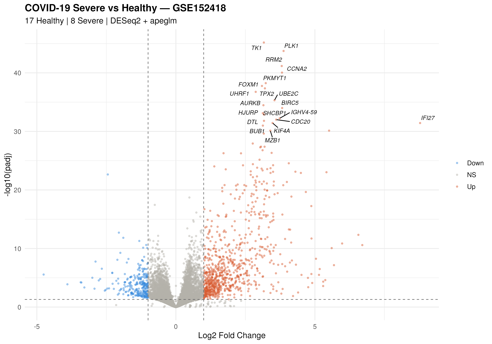

# 🧬 GenomicsSentinel

> Pipeline bioinformatique multi-omique reproductible  
> RNA-Seq · scRNA-Seq · Variant Calling · ML · Docker · Snakemake

---

## Présentation

Projet personnel développé dans le cadre de ma pratique
bioinformatique. Combine mon background en mathématiques
(modèles statistiques, apprentissage par renforcement)
avec les outils standards de la génomique moderne.

**Cas d'application réel** : analyse de l'expression différentielle
dans le COVID-19 sévère (GSE152418, Lucas et al., *Cell* 2020).

---

## Résultats — COVID-19 Severe vs Healthy (GSE152418)

### Analyse différentielle DESeq2

- **17 368 gènes analysés** (après filtrage qualité)
- **6 801 gènes différentiellement exprimés** (padj < 0.05)
- **Top hit : IFI27** — Log2FC = +8.78 — marqueur interféron de type I

| Gène | Log2FC | Fonction biologique |
|------|--------|-------------------|
| IFI27 | +8.78 | Réponse interféron de type I |
| PLK1 | +3.87 | Prolifération cellulaire |
| RRM2 | +3.81 | Synthèse d'ADN |
| CCNA2 | +3.82 | Cycle cellulaire |
| MZB1 | +3.39 | Production d'anticorps |

### Volcano Plot

### GSEA — Pathways enrichis (KEGG)

| Pathway | NES | p.adjust | Interprétation |
|---------|-----|----------|----------------|
| Cell cycle | 2.30 | 1.66e-08 | Prolifération immunitaire explosive |
| Neutrophil extracellular traps | 2.19 | 1e-10 | Dommage pulmonaire COVID |
| Systemic lupus erythematosus | 2.14 | 4.76e-09 | Signature interféron partagée |
| Oxidative phosphorylation | 1.96 | 3.40e-07 | Demande énergétique immunitaire |

---

## Stack technique

| Module | Outils | Description |
|--------|--------|-------------|
| Contrôle qualité | FastQC · Trimmomatic · MultiQC | QC reads, trimming adaptateurs |
| Alignement | STAR · featureCounts | Alignement splice-aware |
| Expression différentielle | DESeq2 · apeglm · clusterProfiler | DE + shrinkage + GSEA |
| scRNA-Seq | Seurat v5 · Harmony · SingleR | Clustering · annotation cell

---

## Contexte personnel

Enseignant de mathématiques , titulaire d'un Master
en bioinformatique (Faculté de Médecine de Rabat).
Mon mémoire portait sur l'application du Q-learning et des
processus de décision markoviens à la prédiction de structure
protéique (modèle HP, 2D/3D).

Ce projet combine cette base théorique avec les outils
pratiques de la génomique computationnelle moderne.

---

## Licence

MIT — voir [LICENSE](LICENSE)